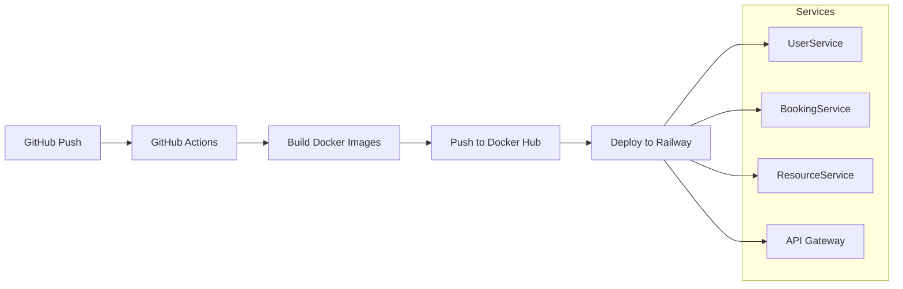

# CI/CD Setup Guide for DriveMate Microservices

This guide explains how to set up the complete CI/CD pipeline for all DriveMate microservices using GitHub Actions, Docker Hub, and Railway.

## 🏗️ Architecture Overview



## 📋 Prerequisites

### 1. Docker Hub Account
- Create account at [Docker Hub](https://hub.docker.com)
- Create repositories for each service:
  - `drivemate-userservice`
  - `drivemate-bookingservice`
  - `drivemate-resourceservice`
  - `drivemate-apigateway`

### 2. Railway Account
- Create account at [Railway](https://railway.app)
- Create 4 separate projects for each service

### 3. GitHub Repository
- Fork or clone this repository
- Ensure you have admin access to configure secrets

## 🔧 Setup Instructions

### Step 1: Configure Docker Hub Repositories

1. **Login to Docker Hub**
2. **Create Public Repositories:**
   ```bash
   # Repository names (replace YOUR_USERNAME with your Docker Hub username)
   YOUR_USERNAME/drivemate-userservice
   YOUR_USERNAME/drivemate-bookingservice
   YOUR_USERNAME/drivemate-resourceservice
   YOUR_USERNAME/drivemate-apigateway
   ```

3. **Generate Access Token:**
   - Go to Account Settings → Security → Access Tokens
   - Create new token with Read/Write permissions
   - Save the token securely

### Step 2: Configure GitHub Secrets

Go to your GitHub repository → Settings → Secrets and variables → Actions

Add the following secrets:

```bash
# Docker Hub Credentials
DOCKERHUB_USERNAME=your_dockerhub_username
DOCKERHUB_TOKEN=your_dockerhub_access_token

# Railway Webhook URLs (get these from Railway project settings)
RAILWAY_USERSERVICE_WEBHOOK=https://railway.app/api/v2/deploy/...
RAILWAY_APIGATEWAY_WEBHOOK=https://railway.app/api/v2/deploy/...
RAILWAY_BOOKINGSERVICE_WEBHOOK=https://railway.app/api/v2/deploy/...
RAILWAY_RESOURCESERVICE_WEBHOOK=https://railway.app/api/v2/deploy/...
```

### Step 3: Setup Railway Projects

For each service, create a Railway project:

#### 3.1 UserService
1. Create new project: `drivemate-userservice`
2. Connect to Docker Hub image: `YOUR_USERNAME/drivemate-userservice:latest`
3. Add environment variables:
   ```bash
   ASPNETCORE_ENVIRONMENT=Production
   ConnectionStrings__DefaultConnection=postgresql://...
   JWT__Key=your-jwt-secret-key
   JWT__Issuer=DriveMate
   JWT__Audience=DriveMate-Users
   JWT__ExpiryInMinutes=60
   SpeedSms__AccessToken=Qa-bueApU0kt3V95enwlrmTdAKzLYqp3
   ```
4. Copy deployment webhook URL to GitHub secrets

#### 3.2 BookingService
1. Create new project: `drivemate-bookingservice`
2. Connect to Docker Hub image: `YOUR_USERNAME/drivemate-bookingservice:latest`
3. Add environment variables:
   ```bash
   ASPNETCORE_ENVIRONMENT=Production
   ConnectionStrings__DefaultConnection=postgresql://...
   JWT__Key=your-jwt-secret-key
   JWT__Issuer=DriveMate
   JWT__Audience=DriveMate-Users
   JWT__ExpiryInMinutes=60
   ```
4. Copy deployment webhook URL to GitHub secrets

#### 3.3 ResourceService
1. Create new project: `drivemate-resourceservice`
2. Connect to Docker Hub image: `YOUR_USERNAME/drivemate-resourceservice:latest`
3. Add environment variables:
   ```bash
   ASPNETCORE_ENVIRONMENT=Production
   ConnectionStrings__DefaultConnection=postgresql://...
   JWT__Key=your-jwt-secret-key
   JWT__Issuer=DriveMate
   JWT__Audience=DriveMate-Users
   JWT__ExpiryInMinutes=60
   ```
4. Copy deployment webhook URL to GitHub secrets

#### 3.4 API Gateway
1. Create new project: `drivemate-apigateway`
2. Connect to Docker Hub image: `YOUR_USERNAME/drivemate-apigateway:latest`
3. Add environment variables:
   ```bash
   ASPNETCORE_ENVIRONMENT=Production
   JWT__Key=your-jwt-secret-key
   JWT__Issuer=DriveMate
   JWT__Audience=DriveMate-Users
   ```
4. Copy deployment webhook URL to GitHub secrets

### Step 4: Setup PostgreSQL Database

Create a shared PostgreSQL database on Railway:

1. **Create Database Project:**
   - New project → Add PostgreSQL
   - Note the connection string

2. **Update Connection Strings:**
   - Use the same database for all services (different schemas)
   - Update all service environment variables

## 🚀 Deployment Workflow

### Automatic Deployment
The CI/CD pipeline triggers on:
- Push to `main`, `master`, or `feature/auth` branches
- Pull requests to `main` or `master`

### Manual Deployment
```bash
# Trigger deployment by pushing to main branch
git push origin main

# Or create a new release
git tag v1.0.0
git push origin v1.0.0
```

### Deployment Process
1. **GitHub Actions triggers** on code push
2. **Build Docker images** for all 4 services
3. **Push images to Docker Hub** with proper tags
4. **Trigger Railway webhooks** for automatic deployment
5. **Services auto-deploy** from updated Docker images

## 📊 Monitoring and Verification

### Health Check Endpoints
After deployment, verify services are running:

```bash
# UserService
curl https://your-userservice.railway.app/health

# BookingService  
curl https://your-bookingservice.railway.app/health

# ResourceService
curl https://your-resourceservice.railway.app/health

# API Gateway
curl https://your-apigateway.railway.app/health
```

### Swagger Documentation
Access API documentation:
- API Gateway: `https://your-apigateway.railway.app/swagger`
- UserService: `https://your-userservice.railway.app/swagger`
- BookingService: `https://your-bookingservice.railway.app/swagger`
- ResourceService: `https://your-resourceservice.railway.app/swagger`

## 🔍 Troubleshooting

### Common Issues

1. **Docker Build Fails:**
   - Check Dockerfile syntax
   - Verify all dependencies are included
   - Check build logs in GitHub Actions

2. **Railway Deployment Fails:**
   - Verify webhook URLs are correct
   - Check environment variables
   - Review Railway deployment logs

3. **Database Connection Issues:**
   - Verify PostgreSQL connection string
   - Check database permissions
   - Ensure database is accessible from Railway

### Debug Commands

```bash
# Check GitHub Actions logs
# Go to repository → Actions → Select workflow run

# Check Railway logs
# Go to Railway project → Deployments → View logs

# Test Docker images locally
docker run -p 8080:80 YOUR_USERNAME/drivemate-userservice:latest
```

## 📝 Environment Variables Reference

### Required for All Services
```bash
ASPNETCORE_ENVIRONMENT=Production
ConnectionStrings__DefaultConnection=postgresql://...
JWT__Key=your-super-secret-jwt-key-at-least-32-chars
JWT__Issuer=DriveMate
JWT__Audience=DriveMate-Users
JWT__ExpiryInMinutes=60
```

### UserService Specific
```bash
SpeedSms__AccessToken=Qa-bueApU0kt3V95enwlrmTdAKzLYqp3
SpeedSms__ApiUrl=https://api.speedsms.vn/index.php/sms/send
SpeedSms__SmsType=4
SpeedSms__Sender=Verify
```

## 🎯 Next Steps

1. **Setup monitoring** with Railway metrics
2. **Configure custom domains** for production
3. **Setup staging environment** for testing
4. **Add database migrations** to deployment pipeline
5. **Configure SSL certificates** for HTTPS

---

**Note:** Replace `YOUR_USERNAME` with your actual Docker Hub username throughout this guide.
